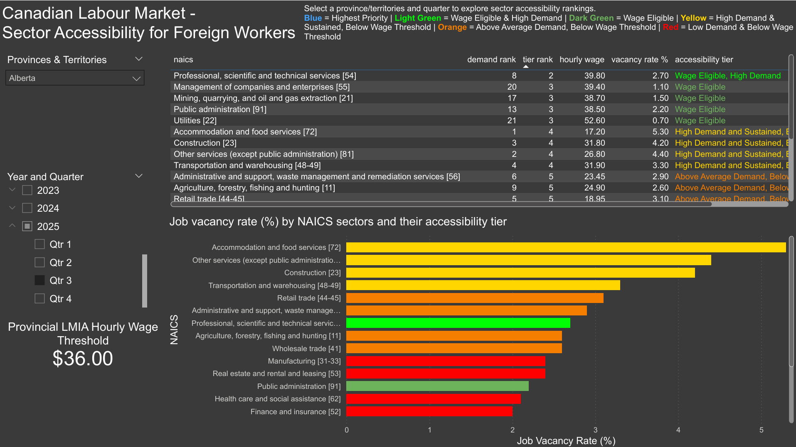
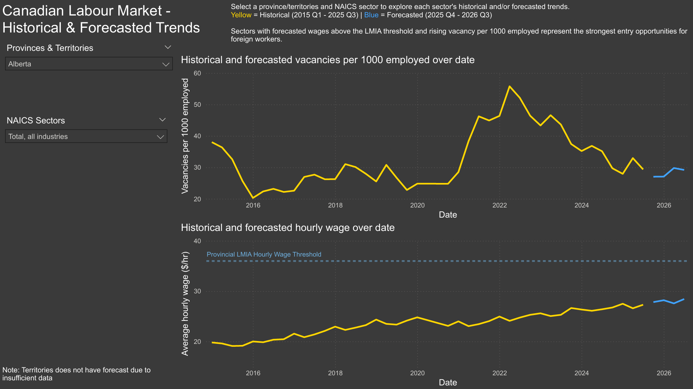
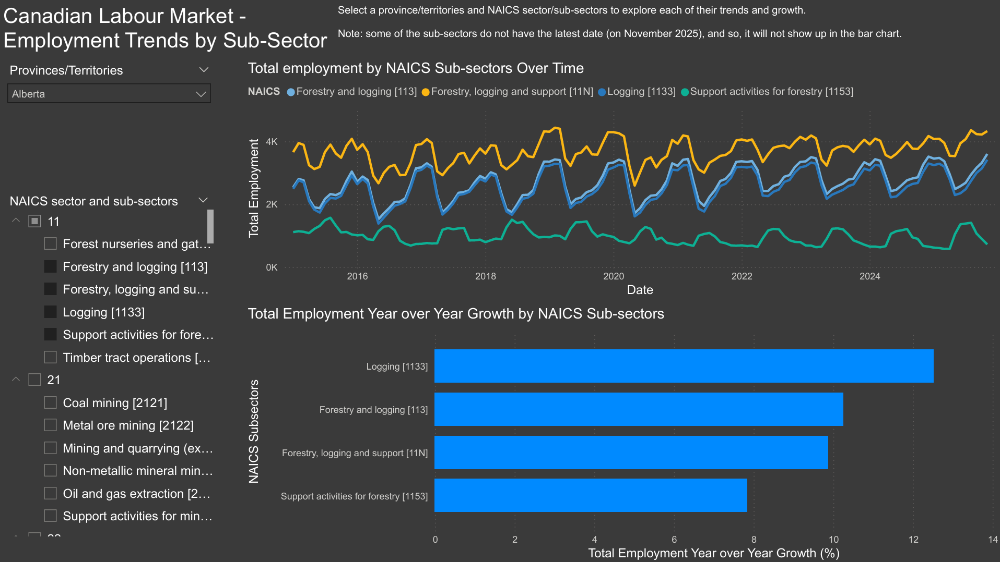

# Canadian Labour Market Data Pipeline
> End-to-end data engineering pipeline processing Statistics Canada job vacancy data - from raw CSV ingestion to analytical dashboards.

## Pipeline Architecture

```
Statistics Canada CSVs
        │
        ▼
   S3 (raw/)                    ← Raw CSV storage
        │
        ▼
   AWS Glue (PySpark)           ← Ingestion, type casting, null handling
        │
        ▼
   S3 (processed/)              ← Intermediate clean Parquet
        │
        ▼
   Databricks                   ← Null and dupe checks, schema validation, pivot from long to wide format
        │  
        ▼
   S3 (curated/)                ← Final Parquet ready for dbt transformation
        │
        ▼
   Databricks (Delta Tables)    ← Curated Parquet registered as managed Delta tables in Unity Catalog
        │
        ▼
   dbt Core(dbt-databricks)     ← Mart models, data tests, documentation                                            
        │
        ▼
   Databricks ML (XGBoost)      ← Time series forecasting of vacancy rates, experiment tracking,                    
   + MLflow                        model versioning
        │
        ▼
   Predictions Delta Table      ← Forecasted rates stored for querying                                              
        │
        ▼
   Streamlit / Power BI         ← Dashboard layer                                                                   
        │
        ▼
   Apache Airflow (Astro CLI)   ← End-to-end orchestration, quarterly scheduling,                                     ← 🔨 In Progress 
                                   pipeline dependency management
                                        ➥ Ingesting        ← 🔨 In Progress 
                                        ➥ Glue             ← 🔨 In Progress 
                                        ➥ Databricks       ← 🔨 In Progress 
                                        ➥ dbt              ← 🔨 In Progress 
                                        ➥ ML               ← 🔨 In Progress 
     
```

## Key Metrics Produced

**Monthly (Provincial & Territory Level)**

*Source metrics (cleaned and structured from Statistics Canada):*
- Job vacancies
- Job vacancy rate
- Payroll employees

*Derived Metrics:*
- Vacancy rate per 1,000 employed workers
- Month-over-month and year-over-year vacancy trend

**Quarterly (Provincial & Territory + Sector Level)**

*Source metrics (cleaned and structured from Statistics Canada):*
- Job vacancies by NAICS sector
- Job vacancy rate by sector
- Payroll employees by sector
- Average offered hourly wage by sector

*Derived metrics:*
- Wage YoY growth by sector
- Highest demand sectors per national, province & territory per quarter
- Sustained high demand sectors (quarters above vacancy threshold)
- Foreign accessibility tier (composite of vacancy rate, wage, and sustained demand)

**NAICS Employment (Provincial & Territory + Sub-sector Level)**

*Source metrics (cleaned and structured from Statistics Canada):*
- Employment by NAICS sub-sector

*Derived metrics:*
- Employment trends by sub-sector 
- Data digital employment concentration
- Fastest growing sub-sectors

---

## Repository Structure

```
├── glue/
│   └── glue_ETL_job.py       # PySpark job: raw CSV → cleaned Parquet
│
├── databricks/
│   ├── transform_vacancy_metrics.ipynb           # Schema work + null/dupe check + pivot + output to S3 (curated)
│   ├── register_curated_tables.ipynb             # Registers curated Parquet as Delta tables in Unity Catalog
│   └── ml_vacancy_and_wage_forecast.ipynb        # XGBoost forecasting + MLflow tracking                              
|
├── dbt/
│   ├── models/
│   │   ├── staging/
│   │   │   ├── sources.yml                  # defines Delta table sources in Databricks
│   │   │   ├── schema.yml                   # column-level tests for staging models
│   │   │   ├── stg_monthly_vacancies.sql    # monthly job vacancies + vacancies per 1,000
│   │   │   ├── stg_naics_employed.sql       # employment figures by NAICS industry
│   │   │   └── stg_quarterly_vacancies.sql  # quarterly vacancies + wage data + vacancies per 1,000 by NAICS
│   │   │
│   │   └── marts/
│   │       ├── schema.yml                             # column-level tests for mart models
│   │       ├── mart_monthly_labour_metrics.sql        # calculation of YoY and MoM change of vacancies per 1,000
│   │       ├── mart_quarterly_sector_metrics.sql      # sector vacancy rates, wages, demand ranking
│   │       └── mart_naics_employment_trends.sql       # sub-sector employment trends, data digital concentration
│   |
│   ├── seeds/
│   │   └── provincial_lmia_wage_thresholds.csv   # Working visa wage threshold of each province and territories  - source: ESDC Canada
│   │
│   ├── tests/
│   └── dbt_project.yml
│
├── airflow/
│   └── dags/
│       └── canada_labour_pipeline.py       # End-to-end DAG: ingest → Glue → Databricks → dbt → ML (To be added)       ← 🔨 In Progress
│
├── dashboard/
│   ├── Canadian_Labour_Market_Analytics_Report.pbix    
│   └── screenshots
│       ├── page1.png
│       ├── page2.png
│       └── page3.png       
│
├── data/
│   └── sample/
│       ├── raw/          # 100-row sample of raw data
│       │   ├── naics_employed_sample.csv        
│       │   ├── monthly_vacancies_sample.csv     
│       │   └── quarterly_vacancies_sample.csv  
│       │
│       ├── curated/      # 100-row samples of curated data
│       │    ├── monthly_curated_sample.csv       
│       │    ├── naics_curated_sample.csv         
│       │    └── quarterly_curated_sample.csv     
│       │
│       └── predicted/    # 100-row samples of predicted data
│            ├── predictions_vacancies_sample.csv
│            └── predictions_wage_sample.csv
│
├── .github/
│   └── workflows/
│       └── dbt_test.yml             # CI: runs dbt test on PR        
│
├── .gitignore
├── requirements.txt
├── SECURITY.md
└── README.md
```

---

## Reproducing This Pipeline

### Prerequisites
- AWS account with S3 and Glue access
- Databricks account (Community Edition works)
- Python 3.10+
- dbt Core installed (`pip install dbt-databricks`)

### 1. Set Up S3 Buckets
```bash
aws s3 mb s3://your-bucket-name
aws s3 cp data/raw/ s3://your-bucket-name/raw/ --recursive
```

### 2. Run the Glue Job
Deploy `glue/glue_etl_job.py` via the AWS Glue console or CLI.
Set the following job parameters:
- `--NAICS_PATH`: `s3://your-bucket-name/raw/NAICS.csv`
- `--MONTHLY_PATH`: `s3://your-bucket-name/raw/Monthly.csv`
- `--QUARTERLY_PATH`: `s3://your-bucket-name/raw/Quarterly/`
- `--OUTPUT_PATH`: `s3://your-bucket-name/processed/`

### 3. Run the Databricks Notebooks
#### transform_vacancy_metrics.ipynb
Import `databricks/transform_vacancy_metrics.ipynb` into Databricks.
Update the S3 paths in cell 2 and run all cells.
Output is written to `s3://your-bucket-name/curated/`.

#### register_curated_tables.ipynb
Import `databricks/register_curated_tables.ipynb` into Databricks.
Update the S3 paths in cell 1 and run it.
Outputs are saved to the Unity Catalog of Databricks.

### 4. Run dbt Models
```bash
cd dbt
dbt deps
dbt seed
dbt run
dbt test
```

### 5. Github Actions CI/CD
The pipeline includes automated dbt testing on every push to `main`. To enable it:
1. Add the following secrets to your GitHub repository under Settings → Secrets → Actions:
   - `DATABRICKS_HOST` - your Databricks workspace URL
   - `DATABRICKS_TOKEN` - your Databricks personal access token
   - `DATABRICKS_HTTP_PATH` - your SQL warehouse HTTP path
2. Push to `main` to trigger the workflow automatically

### 6. Databricks ML (XGBoost) + MLflow
1. Import `databricks/ml_vacancy_and_wage_forecast.ipynb` into Databricks and ensure the following packages are installed:
   - xgboost
   - shap
   - optuna
   - mlflow
2. Run all cells in order. The notebook is self-contained and reads directly from the Delta tables produced in Step 4.

Predictions are saved to `workspace.canada_labour_market.predictions_vacancies` and `predictions_wage` in Unity Catalog.

**Train/test Split:**
- Training: 2015 Q1 - 2023 Q2
- Optuna validation (internal): 2021 Q1 - 2023 Q2
- Test (held out): 2023 Q3 - 2025 Q3

**Model Performance**

| Model | Test RMSE | Test MAPE | R² | vs Naive lag1 RMSE | vs Naive lag4 RMSE |
|-------|-----------|-----------|-----|----------------|----------------|
| Vacancies per 1,000 | 7.56 | 18.8% | 0.731 | -22.7% | -44.4% |
| Avg Hourly Wage | 2.00 | 4.6% | 0.904 | -6.9% | -27.4% |

### 7. Dashboard
Open [`dashboard/Canadian_Labour_Market_Analytics_Report.pbix`](dashboard/Canadian_Labour_Market_Analytics_Report.pbix) in Power BI Desktop.

The report contains three pages:
- **Sector Accessibility** - current foreign accessibility tier rankings by province and quarter
- **Historical & Forecasted Trends** - vacancy and wage trends with XGBoost forecasts through 2025 Q4 to 2026 Q3
- **Employment Trends by Sub-Sector** - monthly employment trends and YoY growth by NAICS sub-sector






### 8.  Apache Airflow (Astro CLI)
⏳ Coming soon - see Pipeline Architecture for current progress

---

## Data Source
Statistics Canada
- [NAICS Employed Data](https://www150.statcan.gc.ca/n1/tbl/csv/14100201-eng.zip) -⚠️ Original website URL may have changed as of February 2026, under investigation
- [Quarterly NAICS Job Vacancies](https://www150.statcan.gc.ca/t1/tbl1/en/tv.action?pid=1410044201&pickMembers%5B0%5D=1.1&cubeTimeFrame.startMonth=01&cubeTimeFrame.startYear=2015&cubeTimeFrame.endMonth=10&cubeTimeFrame.endYear=2025&referencePeriods=20150101%2C20251001)
- [Monthly Job Vacancies](https://www150.statcan.gc.ca/t1/tbl1/en/tv.action?pid=1410037101&cubeTimeFrame.startMonth=01&cubeTimeFrame.startYear=2025&cubeTimeFrame.endMonth=11&cubeTimeFrame.endYear=2025&referencePeriods=20250101%2C20251101)  - Contains no NAICS breakdown

Data is publicly available under the Statistics Canada Open Licence.

## Data Layers (Medallion Architecture)

|   Layer   |      Location                       |             Description                                        |
|-----------|-------------------------------------|----------------------------------------------------------------| 
| 🥉 Bronze | `s3://bucket/raw/`                  | Raw CSV files as ingested from Statistics Canada              |
| 🥈 Silver | `s3://bucket/processed/ & /curated/`| Cleaned, typed Parquet, output of Glue and Databricks |
| 🥇 Gold   | `workspace.canada_labour_market`    | Business metrics, mart models, tested and documented          |

---

## Design Decisions
### Data Ingestion and EDA
**Why Glue for ingestion and Databricks for transformation?**
Glue handled the ingestion layer: column selection, type casting, string normalization, date filtering, and writing partitioned Parquet to S3. Partitioning by Year and GEO at this stage makes downstream reads faster by pruning irrelevant partitions before any transformation begins.

Databricks handled the transformation and validation layer: null and duplicate checks, schema validation, and pivoting the monthly and quarterly vacancy datasets from long to wide format for downstream consumption. The notebook environment suited this stage because the pivot logic and data quality checks required iterative validation before the transformations were stable enough to be committed as repeatable code. 

An initial approach joined NAICS employed (SEPH) data with vacancy datasets to derive total_employment as a denominator for vacancy metrics. Investigation revealed that 22% of quarterly rows showed payroll_employees exceeding total_employment due to methodological differences between JVWS and SEPH; different reference periods, employee definitions, and calibration approaches. The join was removed in favour of using payroll_employees directly from JVWS, which is the more appropriate and internally consistent denominator. NAICS employed data is retained as a standalone table for monthly employment trend analysis by sector.

**Why dbt on Databricks instead of a separate warehouse?**
Running dbt directly on Databricks avoids an unnecessary data movement step into a separate warehouse. The curated Delta tables are already query-ready, and dbt-databricks connects natively to the cluster, keeping the stack unified and reducing infrastructure overhead.

### dbt Models
**Foreign Accessibility Tier methodology**
The foreign accessibility tier is a composite metric designed to identify NAICS sectors most accessible to foreign workers seeking Canadian employment (focus on high wage stream). It combines three signals:

- **Wage eligibility** — whether the sector's average offered hourly wage meets the provincial LMIA high-wage stream threshold (provincial median wage + 20%), sourced directly from Employment and Social Development Canada (ESDC)
- **Vacancy demand** — whether the sector's vacancy rate is above the provincial 75th or 50th percentile for that year, using a data-driven threshold rather than an arbitrary cutoff
- **Sustained demand** — whether the sector has been above the p75 vacancy rate for at least 75% of quarters in the last 2 years, indicating structural rather than temporary labour shortage

**Caveat on Foreign Accessibility Tier** 
Canadian immigration eligibility is formally determined by NOC occupation codes, not NAICS industry codes. This metric uses NAICS-based vacancy and wage data as a proxy. A sector meeting all three conditions is likely to have roles accessible to foreign workers, but individual job eligibility depends on specific NOC codes, employer LMIA applications, and provincial nominee program criteria.

### ML Forecasting
**Missing and Anomalous data Handling**
NAICS sectors with greater than 50% missing data or 4 or more consecutive missing quarters were dropped. Remaining gaps of 1–3 quarters were filled using linear interpolation with ffill for leading edge NAs where interpolation had no prior value to reference. Territories (Northwest Territories, Yukon, Nunavut) were excluded entirely due to missing data exceeding 70%.

The anomalies exceeding 3.5 standard deviations were found in both vacancies (2 instances) and wage (6 instances), mostly concentrated during and after COVID. Two non-COVID wage anomalies stand out: a 2018 Q1 spike in Saskatchewan Healthcare [62], likely driven by contract negotiations and retro-pay settlements, and a 2015 Q2 spike in New Brunswick Information and Cultural Industries [51], likely linked to corporate restructuring following Bell Aliant's privatization. Both were intentionally retained as genuine labour market events rather than data errors.

**Why was linear interpolation chosen and how was it done?**
Linear interpolation was chosen because the quarterly data is evenly spaced, making it equivalent to time-weighted interpolation while being simpler to implement. Gaps were capped at 3 consecutive quarters and beyond that, the NAICS series was dropped entirely rather than imputed, avoiding fabrication and unreliability of extended missing histories. Additionally, bfill was avoided to prevent data leakage during model training.

**Feature Selection** 
Based on ablation testing, permutation testing and dropping the features, numerous columns were removed as they negatively impacted RMSE when included. Final feature set retains:
*Vacancies*
- `vacancies_per_1000_roll2`, `roll3`, `lag4`, `lag6`, `lag5` and `lag3`
- `avg_offered_hourly_wage_lag4`
- `quarter_cos`
- `naics_encoded`, `is_post_covid_boom`, and `is_covid` dummy

*Wage*
- `avg_offered_hourly_wage_lag1`, `lag2`, `lag3`, `lag4`, and `lag6`
- `quarter_cos`

Note: quarter cyclical encoding uses month values (1, 4, 7, 10) rather than quarter numbers (1–4), producing equivalent but geometrically different sin/cos values. Each quarter retains a unique encoding so model learning is unaffected.

---

## Skills Demonstrated
**Implemented**
- Cloud data engineering (AWS S3, Glue)
- Distributed processing (PySpark on Glue, Databricks)
- Data modelling (Medallion architecture: Bronze → Silver → Gold)
- Infrastructure basics (IAM roles, Secrets Manager for credentials)
- Data quality & validation (null checks, deduplication, schema assertions, pre-export validation)
- Analytics engineering (dbt-databricks, staging models, mart models, data tests)
- CI/CD (GitHub Actions running dbt tests on PR)
- Machine learning (XGBoost time series forecasting, MLflow experiment tracking)
- Dashboard development (Power BI)

**In Progress**
- Orchestration (Apache Airflow end-to-end pipeline scheduling)

---

## Security
See [SECURITY.md](./SECURITY.md) for credential handling and IAM role configuration.
